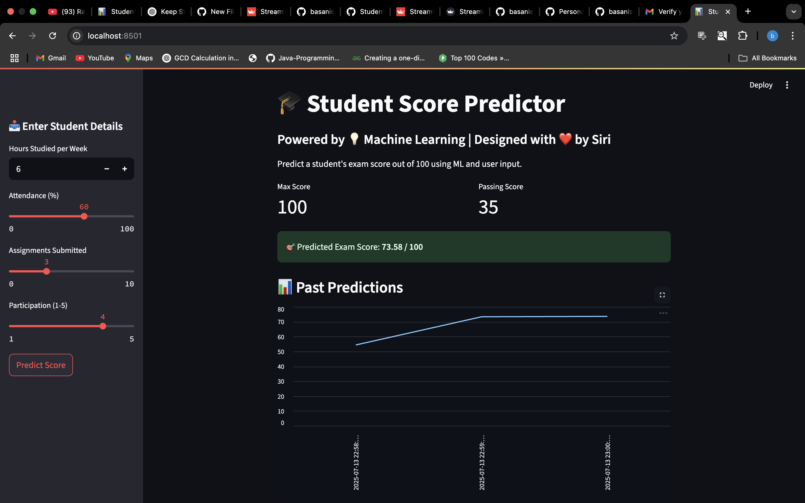

# 🎓 Student Score Predictor

This is a **Machine Learning-powered Streamlit web app** that predicts a student's exam score out of 100.

## 🚀 Live App

👉 [Click here to try it on Streamlit Cloud](https://student-score-predictor.streamlit.app)

---

## 🖼️ Screenshots

### 🔮 Prediction Output


### 📈 Score Trend Chart


---

## 💻 How to Run Locally

### 🧾 Step-by-Step:

```bash
# Clone the repo
git clone https://github.com/basanisiri1704/Student-Score-Predictor.git
cd Student-Score-Predictor

# Create virtual environment (optional)
python3 -m venv venv
source venv/bin/activate  # Mac/Linux

# Install packages
pip install -r requirements.txt

# Run the app
streamlit run app.py
